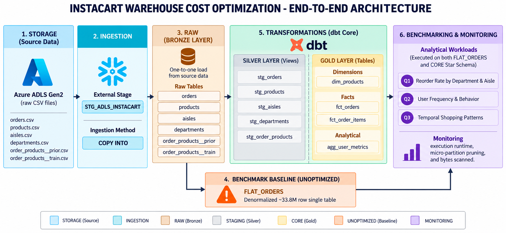
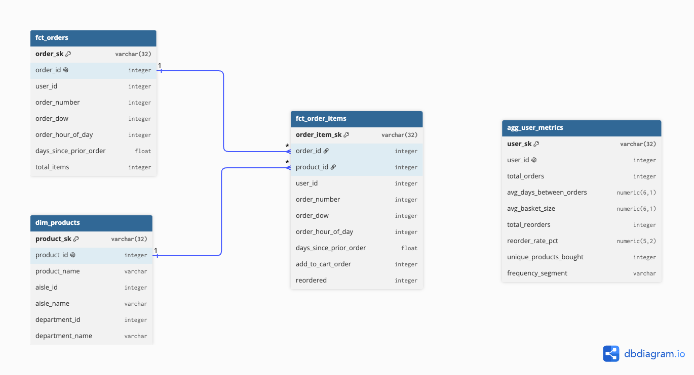

# Instacart Warehouse Cost Optimization


An ELT data warehouse on Snowflake and dbt Core comparing a **~33.8M-row denormalized baseline** against a Kimball Star Schema, reducing total query execution time by 33.2% and overall bytes scanned by 36.6% across core star schema workloads.

---

## Medallion Architecture



---

## Dimensional Model



---

## Benchmark Results

*Collected from `SNOWFLAKE.ACCOUNT_USAGE.QUERY_HISTORY` with `USE_CACHED_RESULT = FALSE`.*

| Workload | Runtime Before | Runtime After | Δ Runtime | Bytes Scanned Before | Bytes Scanned After | Δ Bytes |
| :--- | :---: | :---: | :---: | :---: | :---: | :---: |
| **Q1 — Reorder Rate** | 3.44s | 3.10s | −9.9% | 174 MB | 136 MB | −21.8% |
| **Q2 — User Behavior** | 4.27s | 0.15s | **−96.5%** | 273 MB | 2 MB | **−99.3%** |
| **Q3 — Hourly Patterns** | 1.50s | 0.20s | **−86.7%** | 53 MB | 8 MB | **−84.9%** |

---

## Full Repository Structure

```text
Instacart-Warehouse-Cost-Optimization/
├── assets/
│   ├── architecture_diagram.png
│   └── star_schema.png
├── dbt/
│   ├── macros/
│   │   └── generate_schema_name.sql
│   ├── models/
│   │   ├── marts/
│   │   │   ├── agg_user_metrics.sql
│   │   │   ├── dim_products.sql
│   │   │   ├── fct_order_items.sql
│   │   │   ├── fct_orders.sql
│   │   │   └── marts_models.yml
│   │   └── staging/
│   │       ├── sources.yml
│   │       ├── staging_models.yml
│   │       ├── stg_aisles.sql
│   │       ├── stg_departments.sql
│   │       ├── stg_order_products.sql
│   │       ├── stg_orders.sql
│   │       └── stg_products.sql
│   ├── dbt_project.yml
│   ├── package-lock.yml
│   └── packages.yml
├── monitoring/
│   ├── 04_baseline.sql
│   └── 08_before_after.sql
├── optimized/
│   ├── 06_clustering.sql
│   ├── q1_reorder_rate.sql
│   ├── q2_user_frquency.sql
│   └── q3_shopping_patterns.sql
├── setup/
│   ├── 00_snowflake_setup.sql
│   ├── 01_azure_stage.sql
│   └── 02_raw_tables.sql
├── unoptimized/
│   ├── 03_flat_table.sql
│   ├── q1_reorder_rate.sql
│   ├── q2_user_frquency.sql
│   └── q3_shopping_patterns.sql
├── LICENSE
└── README.md
